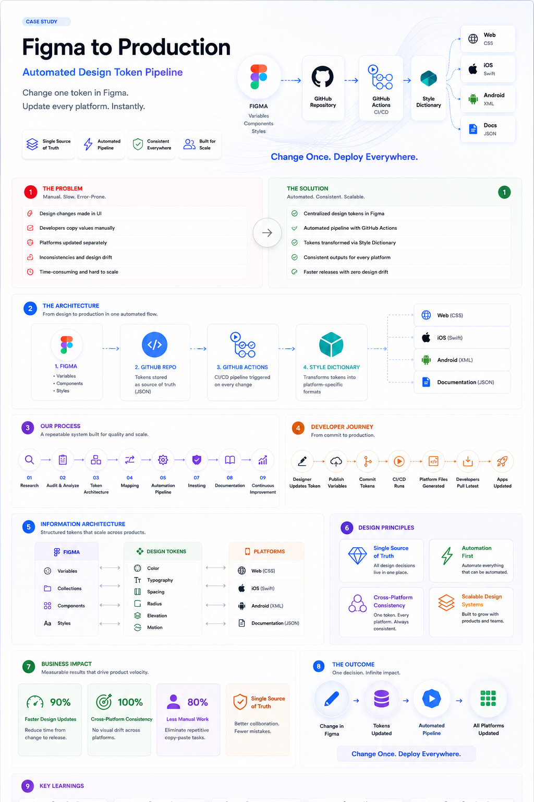

# 🎨 Figma → Production

> **Change one token. Update every platform.**

An interactive case study demonstrating how a centralized design token pipeline keeps Web, iOS, Android, and documentation perfectly synchronized.

🌐 **Live Demo:** https://dhaval-sukharamwala.github.io/figma-to-production/

---

## Overview

Modern products often maintain multiple platforms, each with its own implementation of colors, typography, spacing, radius, and elevation.

Without automation, every design update requires developers to manually copy values into multiple codebases, creating:

- ❌ Visual inconsistencies
- ❌ Design drift
- ❌ Manual effort
- ❌ Slower releases

This project demonstrates how a **single design decision in Figma** automatically propagates across every platform using Design Tokens, GitHub Actions, and Style Dictionary.

---

## The Problem

Traditional workflows rely on manual synchronization.

```text
Designer updates Figma
        ↓
Developer copies values
        ↓
Web updated
        ↓
iOS updated
        ↓
Android updated
        ↓
Documentation updated
```

This process is repetitive, error-prone, and difficult to scale.

---

## The Solution

```text
Figma Variables
        ↓
Design Tokens
        ↓
GitHub Repository
        ↓
GitHub Actions (CI/CD)
        ↓
Style Dictionary
        ↓
CSS • Swift • Android XML • JSON
        ↓
Applications Updated
```

One source of truth.

Every platform stays synchronized.

---

## 👀 Visual Learning

### From Design Decision to Production

The infographic below summarizes the complete lifecycle of a design token—from editing a variable in **Figma** to automatically generating production-ready assets for **Web, iOS, Android, and documentation**.

<p align="center">
  
</p>

### What you'll learn

- 🎨 How Figma Variables become Design Tokens
- ⚙️ How GitHub Actions automates the workflow
- 📦 How Style Dictionary generates platform-specific code
- 📱 How Web, iOS, and Android stay perfectly synchronized
- 🚀 Why automated design systems scale better than manual workflows

> **Key takeaway:** Change a token once in Figma. Every platform stays synchronized through an automated pipeline.

---

# Features

### ✅ Editable Design Tokens

- Colors
- Typography
- Spacing
- Radius
- Elevation

### ✅ Live Pipeline Simulation

- Figma Export
- Git Commit
- GitHub Actions
- Style Dictionary
- Platform Builds

### ✅ Multi-platform Outputs

- CSS Variables
- Swift Tokens
- Android XML
- JSON Documentation

### ✅ Live Applications

- React Web Dashboard
- Native Mobile UI

### ✅ Accessibility

- Contrast validation
- Light & Dark mode support

---

# Project Walkthrough

| Section | Purpose |
|----------|---------|
| 🎨 Token Editor | Modify design tokens directly |
| ⚙️ Pipeline | Watch the CI/CD workflow |
| 💻 Generated Code | View platform-specific outputs |
| 📱 Applications | Compare Web and Mobile rendering |
| 📊 Metrics | Quantify consistency across platforms |
| 💡 Business Value | Explain why design tokens matter |
| 🚀 Outcome | Demonstrate the end-to-end impact |

---

# Business Impact

This workflow reduces repetitive work by moving design decisions into an automated pipeline.

### Benefits

- 🚀 Faster design-to-development handoff
- 🎯 Consistent UI across every platform
- 🔁 Eliminates manual copy-paste
- 📦 Single source of truth
- ♿ Accessibility built into the workflow
- 📈 Scales effortlessly as products grow

---

# My Role

I designed and built this end-to-end portfolio case study, including:

- UX Strategy
- Information Architecture
- Design System Planning
- Design Token Architecture
- Interactive Prototype
- Pipeline Visualization
- Technical Storytelling
- Front-end Development

---

# Technical Stack

- HTML
- CSS
- JavaScript
- GitHub Pages
- GitHub Actions *(simulated)*
- Style Dictionary *(simulated)*
- Figma Variables
- Design Tokens

---

# Scope

This project intentionally simulates the automation pipeline.

There is **no live Figma API**, **real CI/CD execution**, or **production deployment** running behind the scenes.

The simulation accurately represents how a modern design token workflow operates while keeping the project lightweight and easy to explore.

---

# Run Locally

```bash
git clone https://github.com/dhaval-sukharamwala/figma-to-production.git

cd figma-to-production

python3 -m http.server 8000

# or

npx serve .
```

Open:

```text
http://localhost:8000
```

---

# Deployment

The project is deployed using **GitHub Pages**.

Every push to the deployment branch automatically updates the live demo.

---

# Author

**Dhaval Sukharamwala**

Senior UI/UX Designer • Product Designer • Design Systems

📧 dhavaldvl00@gmail.com

💼 https://www.linkedin.com/in/dhaval-sukharamwala/

---

## Key Takeaway

> **Design decisions should live in code, not in memory.**

A centralized design token pipeline transforms one update in Figma into consistent experiences across every platform—making products faster to build, easier to maintain, and more reliable at scale.
